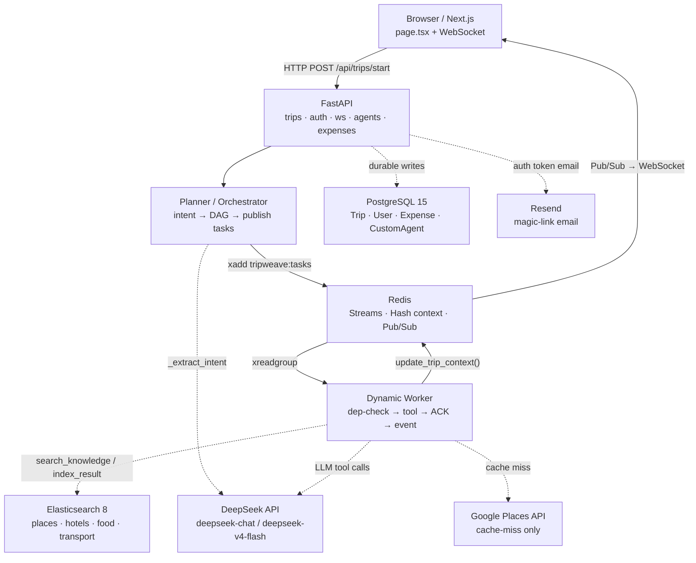
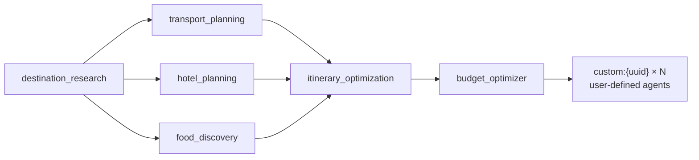
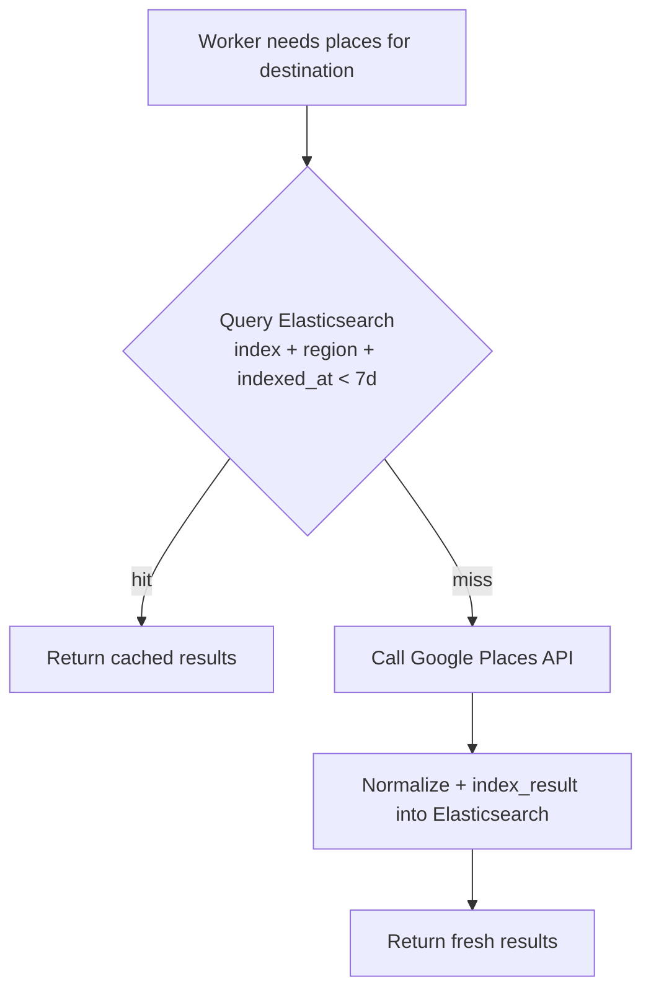
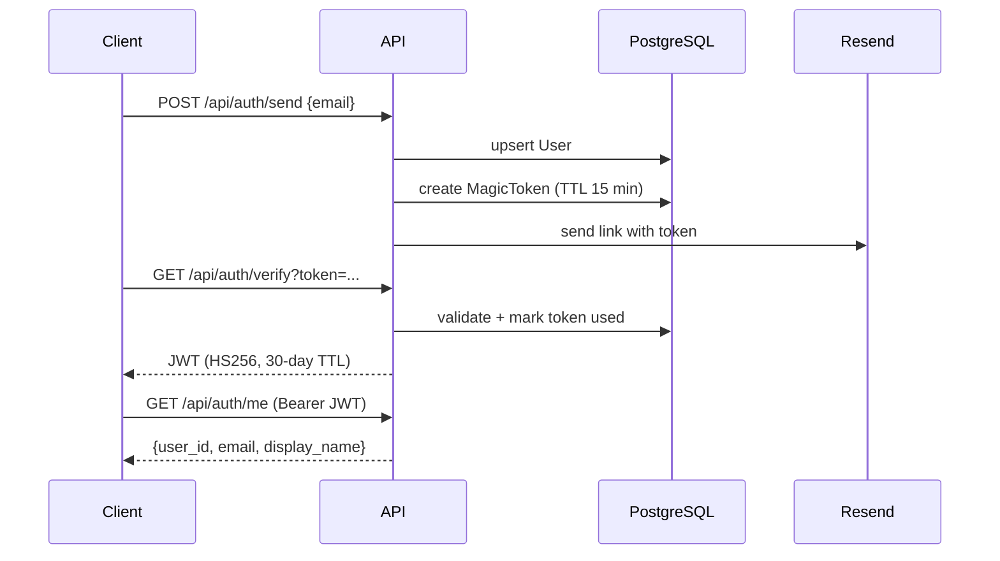
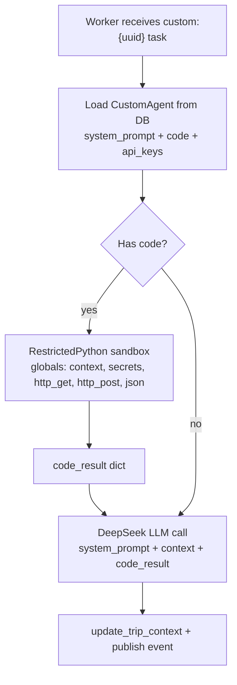
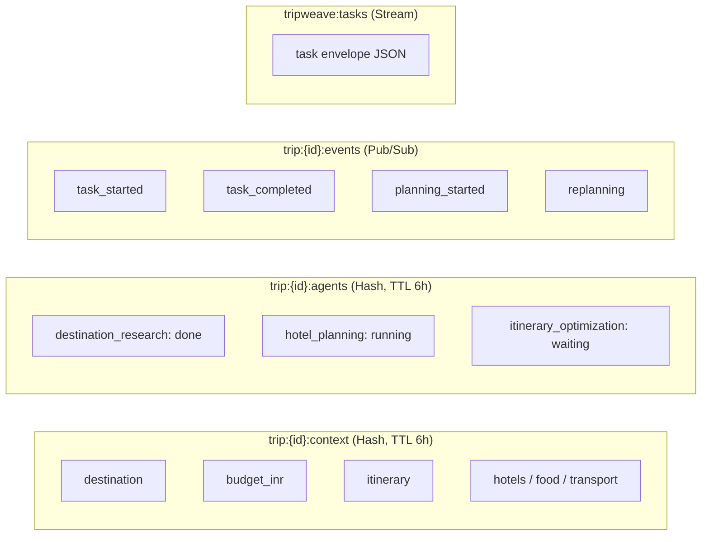

# TripWeave

Autonomous multi-agent travel planning with DAG orchestration, live progress over WebSocket, collaborative trip management, and shared expense settlement.

## What This Project Does

- Converts a natural language trip brief into structured intent.
- Builds a task DAG for destination research, transport, hotels, food, itinerary, and budget.
- Executes tasks asynchronously through Redis Streams workers.
- Caches travel search data in Elasticsearch with freshness and region routing.
- Streams planning progress in real time to the frontend.
- Supports custom user-defined agents (prompt + sandboxed Python code).
- Supports trip members, invite links, and expense balancing/settlement.

## Design And Analysis Artifacts

- **Interactive architecture doc** → [View architecture.html](https://htmlpreview.github.io/?https://github.com/SaptarshiBorgohain/multiAgent-spawn/blob/main/architecture.html)
- **Graphify interactive graph** → [View graph.html](https://htmlpreview.github.io/?https://github.com/SaptarshiBorgohain/multiAgent-spawn/blob/main/graphify-out/graph.html)
- Graphify report: [graphify-out/report.md](graphify-out/report.md)
- Graphify summary: [graphify-out/GRAPH_REPORT.md](graphify-out/GRAPH_REPORT.md)
- Graphify graph data: [graphify-out/graph.json](graphify-out/graph.json)
- Graphify manifest: [graphify-out/manifest.json](graphify-out/manifest.json)

## System Architecture

> For the full styled diagram open the [interactive architecture doc](https://htmlpreview.github.io/?https://github.com/SaptarshiBorgohain/multiAgent-spawn/blob/main/architecture.html).

### End-to-End Request Flow



### Task DAG — Planning Stages



### Cache-First Elasticsearch Search



### Magic Link Auth Flow



### Custom Agent Sandbox Execution



### Redis Three-Namespace Model



## Core Data Flow

1. Client calls `POST /api/trips/start` with user query.
2. Planner extracts intent and publishes DAG tasks to Redis Streams.
3. Workers consume one task at a time, verify dependencies, run handlers.
4. Handlers read/write context in Redis and publish status events.
5. Frontend listens on `/ws/{session_id}` and updates live UI.
6. Durable entities remain in PostgreSQL.

## Tech Stack

| Layer | Technology |
|---|---|
| Frontend | Next.js 16, React 18, TailwindCSS |
| API | FastAPI, Uvicorn, WebSockets |
| Queue/Runtime State | Redis Streams + Hash + Pub/Sub |
| Database | PostgreSQL 15, SQLAlchemy async, asyncpg |
| Search Cache | Elasticsearch 8 |
| LLM Client | OpenAI SDK against DeepSeek base URL |
| External Data | Google Places API |
| Auth | Magic link + JWT (HS256) |
| Sandbox | RestrictedPython |

## Environment Variables

Use `.env.example` as template and create `.env`.

| Variable | Required | Description |
|---|---|---|
| DEEPSEEK_API_KEY | Yes | API key for DeepSeek LLM calls |
| GOOGLE_PLACES_API_KEY | Optional | Google Places key (fallback sample data if missing) |
| REDIS_URL | Yes | Redis connection string |
| DATABASE_URL | Yes | Async PostgreSQL URL |
| ELASTICSEARCH_URL | Yes | Elasticsearch URL |
| SECRET_KEY | Yes | JWT signing key |
| ENVIRONMENT | Optional | App environment label |
| RESEND_API_KEY | Optional | Enables email delivery for magic links |
| APP_URL | Optional | Frontend base URL used in email links |

## Quick Start (Docker)

```bash
cp .env.example .env
# set DEEPSEEK_API_KEY at minimum
docker compose up --build
```

Endpoints:

- Frontend: http://localhost:3000
- API: http://localhost:8000
- API docs: http://localhost:8000/docs
- Elasticsearch: http://localhost:9200

## Services In Compose

- `redis`: task bus and runtime context.
- `postgres`: durable app data.
- `elasticsearch`: search cache and retrieval layer.
- `api`: FastAPI application (`--reload` in dev).
- `worker`: background task processor (`python worker_runner.py`).
- `frontend`: Next.js dev server.

## API Surface

### Auth (`/api/auth`)

- `POST /send` send magic link.
- `GET /verify` verify magic token and return JWT.
- `GET /me` return current user from Bearer JWT.

### Trips (`/api/trips`)

- `POST /clarify` generate follow-up questions from a user brief.
- `POST /start` start planning session (supports `custom_agent_ids`).
- `GET /{session_id}/context` read current merged context.
- `POST /{session_id}/rerun-agent` rerun one agent and optionally re-optimize.
- `POST /{session_id}/replan` trigger replan monitor.

### Members (`/api/trips`)

- `POST /{session_id}/invite` generate invite link.
- `POST /{session_id}/join` join via invite token.
- `POST /{session_id}/members` add member directly.
- `GET /{session_id}/members` list members.
- `PATCH /{session_id}/members/{user_id}` update role.

### Expenses (`/api/trips`)

- `POST /{session_id}/expenses` create expense.
- `GET /{session_id}/expenses` list expenses.
- `DELETE /{session_id}/expenses/{expense_id}` delete expense.
- `GET /{session_id}/expenses/balances` net balances by member.
- `GET /{session_id}/expenses/settlement` minimized settlement transactions.
- `POST /{session_id}/expenses/settle` mark portions as settled.

### Custom Agents (`/api/custom-agents`)

- `GET /` list custom agents.
- `POST /` create custom agent.
- `PUT /{agent_id}` update.
- `DELETE /{agent_id}` delete.
- `POST /ai-generate` generate prompt/code using LLM.
- `POST /lint` syntax-check custom Python code.
- `POST /{agent_id}/test` execute against context in sandbox.

### WebSocket

- `/ws/{session_id}` live event stream for task status and planning progress.

## Project Layout

```text
app/
  backend/
    api/                 # auth, trips, members, expenses, custom agents, websocket
    cache/               # Redis streams/hash/pubsub helpers
    db/                  # SQLAlchemy models + async session
    orchestrator/        # planner DAG + context orchestration
    search/              # Elasticsearch cache layer
    workers/             # worker loop + tool handlers + sandbox execution
    main.py              # FastAPI app entrypoint
    worker_runner.py     # worker process runner
    requirements.txt
  frontend/
    app/                # Next.js app router UI
    package.json
docker-compose.yml
architecture.html
graphify-out/
```

## Operational Notes

- Worker code is not auto-reloaded by default; recreate worker container after worker changes:

```bash
docker compose up -d --force-recreate worker
```

- API has reload enabled in compose.
- Redis and Elasticsearch are required for successful trip planning flow.

## Security Notes

- Magic links are short-lived and one-time use.
- JWT is signed with `SECRET_KEY`; rotate this in production.
- Custom agent code runs under RestrictedPython sandbox, but production hardening should still enforce execution limits and strict egress controls.
